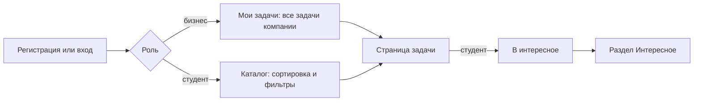
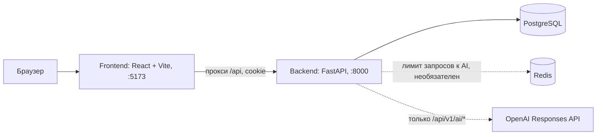

# 1. Late Workers — каталог бизнес-задач для студенческих команд

**Презентация проекта:** [Late Workers.pptx](Late%20Workers.pptx)

## 2. Краткое описание

Малому и среднему бизнесу нужны исполнители для прикладных задач, а студентам — реальные задачи для практики. Проект — веб-платформа, где задачи бизнеса собраны в общий каталог с рейтингом готовности 0–100 и уровнем, а студенты просматривают каталог, фильтруют его и сохраняют интересные задачи. Текущая версия реализует регистрацию по ролям, каталог, страницу задачи, «Интересное» студента и «Мои задачи» бизнеса.

## 3. Что реализовано

### Бизнес

- Регистрация: email, пароль, название компании, контактное лицо, телефон. Вход, выход, восстановление сессии после перезагрузки страницы.
- Раздел «Мои задачи» (`/business`): таблица всех задач компании во всех статусах, включая черновики, с рейтингом, уровнем, числом откликов и датой изменения. Из таблицы открывается страница задачи.
- Просмотр своих черновиков: задача в статусе «Черновик» видна только владельцу, для остальных — 404.
- Просмотр общего каталога.

### Студент

- Регистрация: email, пароль, имя, навыки и технологии (теги). Вход, выход, восстановление сессии.
- Каталог (`/catalog`): опубликованные задачи и задачи в работе, по 20 на страницу.
  - Сортировка по рейтингу, дате публикации, числу откликов.
  - Фильтры по отрасли (10 отраслей) и уровню готовности, можно выбрать несколько значений.
  - Сортировка, фильтры и страница хранятся в адресе, ссылку можно скопировать.
- Страница задачи (`/catalog/:id`): название, компания, отрасль, статус, рейтинг, уровень, число откликов, дата публикации и 9 полей карточки: контекст, потребность, пользователи, данные и материалы, ограничения, ожидаемый результат, критерии успеха, контакт, формат взаимодействия.
- Кнопка «В интересное» и раздел «Интересное» (`/student`) со списком сохранённых задач.

### Команда

Команды студентов в коде не реализованы: нет сущности команды, капитана, участников и откликов. См. раздел 10.

### Общее

- Доступ по ролям: гость перенаправляется на вход, пользователь другой роли — в свой раздел. На сервере роль проверяется по записи в БД (401 без входа, 403 при чужой роли).
- Интерфейс на русском, казахском и английском, светлая и тёмная темы.
- Уровень готовности вычисляется кодом из рейтинга: 0–39 «Требует уточнения», 40–69 «Рабочая», 70–89 «Готовая», 90–100 «Приоритетная» (`backend/app/core/catalog.py`).
- AI-чат через OpenAI доступен только как API-эндпоинт (`/api/v1/ai/chat`), без экрана в интерфейсе. См. раздел 6.

## 4. Как работает решение



1. Пользователь регистрируется как бизнес или студент. Сервер создаёт аккаунт и профиль, ставит HttpOnly-cookie с JWT.
2. Бизнес попадает в «Мои задачи», студент — в каталог.
3. Каталог запрашивает `GET /api/tasks` с параметрами `sort`, `industry`, `level`, `page`. Сервер показывает только задачи в статусах «Опубликована» и «В работе» и для каждой карточки добавляет уровень по рейтингу.
4. Страница задачи загружает полную карточку через `GET /api/tasks/{id}`.
5. Студент сохраняет задачу (`POST /api/tasks/{id}/save`) и видит её в «Интересном» (`GET /api/me/saved-tasks`).

Задачи, их рейтинги и число откликов сейчас попадают в БД только из демо-данных (`seed`): интерфейса и API для создания задач нет.

## 5. Технологии

| Слой | Технология | Где подтверждается |
|---|---|---|
| Язык бэкенда | Python 3.12 | `backend/.python-version`, `backend/pyproject.toml` |
| Веб-фреймворк | FastAPI, Uvicorn | `backend/pyproject.toml` |
| ORM и миграции | SQLAlchemy 2 (async), asyncpg, Alembic | `backend/pyproject.toml`, `backend/alembic/versions/` |
| Валидация и настройки | Pydantic 2, pydantic-settings | `backend/app/core/config.py` |
| Аутентификация | PyJWT (HS256), pwdlib (argon2, bcrypt), HttpOnly-cookie | `backend/app/core/security.py` |
| База данных | PostgreSQL 16 | `docker-compose.yml` (`postgres:16-alpine`) |
| Кеш и лимиты | Redis 7 (необязателен, лимит запросов к AI) | `docker-compose.yml`, `backend/app/api/rate_limit.py` |
| AI API | OpenAI Responses API, SDK `openai` | `backend/app/services/ai.py` |
| AI-модель | `gpt-5.5` по умолчанию, меняется переменной `OPENAI_MODEL` | `backend/app/core/config.py` |
| Язык фронтенда | TypeScript | `frontend/package.json` |
| UI | React 19, React Router 7, Tailwind CSS 4, lucide-react | `frontend/package.json` |
| Сборка | Vite 8 | `frontend/vite.config.ts` |
| Данные и формы | TanStack Query, Zustand, Axios, React Hook Form, Zod | `frontend/package.json` |
| Локализация | i18next (ru, kk, en) | `frontend/public/locales/` |
| Тесты | pytest, pytest-asyncio, httpx (бэкенд); Playwright (фронтенд) | `backend/tests/`, `frontend/e2e/` |
| Линтеры | Ruff; ESLint, Prettier, tsc | `backend/pyproject.toml`, `frontend/package.json` |
| Инфраструктура | Docker, Docker Compose, Make, uv, Yarn 1 | `docker-compose.yml`, `Makefile`, `frontend/yarn.lock` |

## 6. Архитектура



- Фронтенд обращается к относительному пути `/api`; dev-сервер Vite проксирует его на FastAPI (`API_PROXY_TARGET`), поэтому cookie работает без CORS-настроек в браузере.
- Бэкенд разделён на роутеры (`app/api`), сервисы (`app/services`), модели (`app/models`) и схемы (`app/schemas`). Миграции Alembic применяются при старте API, если `AUTO_MIGRATE=true`.
- Таблицы: `users`, `businesses`, `students`, `industries` (справочник заполняется миграцией), `tasks`, `saved_tasks`, а также `notes` из шаблона проекта.
- Redis используется только для ограничения числа запросов к AI-эндпоинтам (фиксированное окно, по умолчанию 20 в минуту на пользователя). Без `REDIS_URL` ограничение отключается.
- `GET /health` сообщает состояние API, базы данных и Redis.

### Эндпоинты

| Метод и путь | Доступ | Назначение |
|---|---|---|
| `POST /api/auth/register/business` | гость | Регистрация бизнеса |
| `POST /api/auth/register/student` | гость | Регистрация студента |
| `POST /api/auth/login`, `POST /api/auth/logout`, `GET /api/auth/me` | — | Вход, выход, текущий пользователь |
| `GET /api/industries` | вошедший | Справочник отраслей |
| `GET /api/tasks` | вошедший | Каталог: `sort`, `industry`, `level`, `page` |
| `GET /api/tasks/{id}` | вошедший | Страница задачи |
| `POST`, `DELETE /api/tasks/{id}/save` | студент | Добавить в «Интересное» или убрать |
| `GET /api/me/saved-tasks` | студент | «Интересное» |
| `GET /api/business/tasks` | бизнес | «Мои задачи» |
| `POST /api/v1/ai/chat`, `POST /api/v1/ai/chat/stream` | вошедший | AI-чат, ответ целиком или SSE-поток |
| `/api/v1/auth/login`, `/api/v1/users/me`, `/api/v1/notes` | — | Шаблонные эндпоинты, в интерфейсе не используются |
| `GET /health` | все | Проверка состояния |

Полная схема: `http://localhost:8000/docs`.

### AI-модуль

Модуль `backend/app/services/ai.py` — универсальный чат поверх OpenAI Responses API.

- Операции: `chat` (ответ целиком) и `chat_stream` (Server-Sent Events: `delta`, затем `done` или `error`). Обе читают один потоковый ответ OpenAI.
- Промпт: системный промпт из `AI_SYSTEM_PROMPT` (по умолчанию общий промпт ассистента) или поле `system` из запроса. Предметных промптов для задач нет.
- Ошибки OpenAI (неверный ключ, лимит, недоступность, отказ модели) переводятся в единый JSON-формат ошибок API.
- Лимит запросов — через Redis, см. выше.

Структурированных ответов (Structured Outputs), проверки фактов по источникам, резервного режима без OpenAI, кеша ответов и журнала вызовов в коде нет. Без `OPENAI_API_KEY` AI-эндпоинты возвращают ошибку; остальные функции платформы от OpenAI не зависят.

## 7. Установка и запуск

### Требования

| Инструмент | Версия | Источник |
|---|---|---|
| Python | 3.12+ | `backend/.python-version`, `requires-python` |
| uv | любая актуальная | `backend/Makefile` |
| Node.js | 22.12+ | `frontend/Dockerfile` (`node:22`), `frontend/README.md` |
| Yarn | 1.x (1.22) | `frontend/yarn.lock`, `frontend/Dockerfile` |
| Docker с Compose v2 | — | `docker-compose.yml` |
| make | — | `Makefile` |

### Клонирование

```bash
git clone git@github.com:BAITC-Hacks/hack-f8263889-late-workers.git
```

```bash
cd hack-f8263889-late-workers
```

### Вариант А. Весь стек в Docker

Файл `backend/.env` необязателен; без него AI-эндпоинты не работают, остальное работает.

```bash
make env
```

```bash
make docker-up
```

Поднимаются PostgreSQL, Redis, API и фронтенд; миграции применяются при старте API. Демо-данные загружаются во втором терминале (команда удаляет все существующие аккаунты и их данные):

```bash
docker compose exec api python -m app.seed
```

Остановка: `make docker-down`, остановка с удалением базы: `make docker-reset`.

### Вариант Б. Локальный запуск

1. Установить зависимости и создать `backend/.env` и `frontend/.env` из примеров:

```bash
make setup
```

2. Запустить PostgreSQL (порт `5439`) и Redis в Docker:

```bash
make infra
```

3. Применить миграции (они также применяются автоматически при старте API):

```bash
make -C backend migrate
```

4. Загрузить демо-данные. Команда удаляет все существующие аккаунты и связанные данные:

```bash
make -C backend seed
```

5. Запустить API и фронтенд вместе:

```bash
make dev
```

По отдельности: `make backend` и `make frontend`.

### Адреса

| Что | Адрес |
|---|---|
| Веб-приложение | http://localhost:5173 |
| API и Swagger | http://localhost:8000/docs |
| Проверка состояния | http://localhost:8000/health |
| PostgreSQL для внешних клиентов | `localhost:5439`, база `app`, пользователь и пароль `postgres` (только для локальной разработки) |

### Переменные окружения бэкенда (`backend/.env`)

| Переменная | Пример в `.env.example` | Назначение |
|---|---|---|
| `ENV` | `dev` | `dev`, `test` или `prod`. При `prod` обязателен свой `SECRET_KEY`, cookie получает `Secure`, `seed` отказывается запускаться |
| `DEBUG` | `true` | Режим отладки |
| `LOG_LEVEL` | `INFO` | Уровень логирования |
| `CORS_ORIGINS` | `http://localhost:3000,...` | Разрешённые источники через запятую |
| `DATABASE_URL` | `postgresql+asyncpg://...@localhost:5439/app` | Подключение к PostgreSQL |
| `TEST_DATABASE_URL` | `...@localhost:5439/app_test` | База для тестов |
| `AUTO_MIGRATE` | `true` | Применять миграции при старте API |
| `REDIS_URL` | закомментирована | Redis для лимита запросов к AI; пусто — лимит выключен |
| `AI_RATE_LIMIT_PER_MINUTE` | `20` | Лимит запросов к AI на пользователя в минуту |
| `SECRET_KEY` | заглушка | Ключ подписи JWT, сгенерировать: `openssl rand -hex 32` |
| `ACCESS_TOKEN_EXPIRE_MINUTES` | `10080` | Срок жизни токена и cookie (7 дней) |
| `AUTH_COOKIE_SAMESITE` | `Lax` | `Lax`, `Strict` или `None` |
| `OPENAI_API_KEY` | пусто | Ключ OpenAI, нужен только для AI-эндпоинтов |
| `OPENAI_BASE_URL` | закомментирована | Прокси или совместимый с OpenAI адрес |
| `OPENAI_MODEL` | `gpt-5.5` | Модель OpenAI |
| `OPENAI_MAX_OUTPUT_TOKENS` | `4096` | Лимит токенов ответа |
| `OPENAI_REASONING_EFFORT` | закомментирована | Уровень рассуждений модели; пусто — по умолчанию провайдера |
| `AI_SYSTEM_PROMPT` | общий промпт ассистента | Системный промпт AI-чата по умолчанию |

### Переменные окружения фронтенда (`frontend/.env`)

| Переменная | Пример в `.env.example` | Назначение |
|---|---|---|
| `AUTH_MOCKS` | `false` | `true` — моки авторизации и каталога в dev-сервере Vite, без бэкенда |
| `API_PROXY_TARGET` | `http://127.0.0.1:8000` | Куда Vite проксирует `/api` |
| `VITE_APP_ENV` | `development` | Метка окружения: `development`, `staging`, `production` |

### Тесты и проверки

Тесты бэкенда (нужен запущенный `make infra`; тестовая база `app_test` создаётся автоматически):

```bash
make test
```

Линтеры и проверка типов обоих приложений:

```bash
make lint
```

Сборка фронтенда:

```bash
cd frontend && yarn build
```

Браузерные тесты фронтенда (работают на моках, Chromium устанавливается один раз):

```bash
cd frontend && npx playwright install chromium && yarn test:e2e
```

## 8. Как проверить решение

Перед проверкой выполните установку из раздела 7 вместе с `seed`. Пароль всех демо-аккаунтов — `demo2026`.

| Роль | Email | Пароль |
|---|---|---|
| Бизнес, Кофейня «Зерно» | `owner@zerno.kz` | `demo2026` |
| Бизнес, Караван Логистика | `logistics@karavan.kz` | `demo2026` |
| Бизнес, Медцентр «Саулык» | `clinic@saulyk.kz` | `demo2026` |
| Студент, Арман Сейтказы | `arman@student.kz` | `demo2026` |

Остальные студенты из seed: `aisha@`, `daniyar@`, `madina@`, `timur@`, `kamila@student.kz`, пароль тот же.

1. Откройте http://localhost:5173. Гость попадает на страницу входа.
2. Войдите как `owner@zerno.kz`. Откроется «Мои задачи» с тремя задачами: «Программа лояльности для постоянных гостей» (92, «Приоритетная»), «Прогноз спроса на выпечку» (78, «Готовая») и черновик «Чат-бот для брони столиков» (0, «Требует уточнения»).
3. Откройте черновик. Страница задачи доступна владельцу; заполнено только поле «потребность», остальные помечены «Не указано».
4. Перейдите в «Каталог». В нём 6 задач трёх компаний; черновика нет. По умолчанию сортировка по рейтингу, первой идёт задача с рейтингом 92.
5. Смените сортировку на «по откликам» и выберите фильтр уровня «Готовая»: останутся задачи с рейтингом 70–89 (78 и 70). Параметры видны в адресной строке.
6. Выйдите и войдите как `arman@student.kz`. Откроется каталог.
7. Откройте любую задачу и нажмите «В интересное». Надпись кнопки сменится на «В интересном». Та же кнопка есть на карточках каталога.
8. Перейдите в «Интересное»: там сохранённая задача. Нажмите «В интересном» на её карточке, чтобы убрать её из сохранённых.
9. Переключите язык (RU, KK, EN) и тему в верхней панели.
10. Необязательно: откройте http://localhost:8000/docs и проверьте эндпоинты. Для AI-чата нужен `OPENAI_API_KEY` в `backend/.env`.

## 9. Данные и интеграции

### Синтетические данные

Команда `seed` (`backend/app/seed.py`) удаляет всех пользователей со связанными данными и загружает JSON-файлы из `backend/seed/`:

| Файл | Объём | Содержание |
|---|---|---|
| `businesses.json` | 3 | Кофейня «Зерно», Караван Логистика, Медцентр «Саулык» |
| `students.json` | 6 | Имена, навыки и технологии |
| `tasks.json` | 7 | 5 опубликованных, 1 в работе, 1 черновик; рейтинги от 0 до 92, число откликов от 0 до 6 |

Справочник из 10 отраслей создаётся миграцией. Все даты в seed фиксированы, повторный запуск даёт те же данные. При `ENV=prod` seed не запускается.

Для работы фронтенда без бэкенда (`AUTH_MOCKS=true`) есть отдельный набор моков в `frontend/dev/`: 26 задач и другие пароли (`owner@zerno.kz` / `coffee2026`, `arman@student.kz` / `arman2026`), см. `frontend/README.md`.

### Внешние API

Единственный внешний API — OpenAI. В него отправляются только данные из тела запроса к `/api/v1/ai/chat` и `/api/v1/ai/chat/stream`: сообщения диалога, системный промпт и параметры модели. Сервис AI не читает базу данных, поэтому аккаунты, профили, контакты бизнеса и задачи в OpenAI не передаются.

## 10. Ограничения

Из замысла не реализовано:

- Конструктор задачи: ввод черновика, уточняющие вопросы AI, сборка карточки AI, редактирование и публикация. Создать или изменить задачу через интерфейс или API нельзя; задачи появляются только из seed.
- Расчёт рейтинга по 7 блокам с весами, оценка качества блоков AI, расшифровка рейтинга и подсказки. Рейтинг хранится готовым числом из seed; код вычисляет из него только уровень.
- Предметные AI-операции (анализ, сборка карточки, оценка блоков), Structured Outputs, проверка источников `D*`/`A*`, резервный режим без OpenAI, кеш ответов AI в Redis, журнал вызовов `ai_calls`.
- Команды студентов (капитан, участники до 5 человек), отклики на задачи, правка и отзыв откликов, «Мои отклики». Поле «число откликов» заполняется только из seed.
- Выбор и отклонение откликов бизнесом, этапы и баллы команд, рекомендации задач, прогресс-бар, бейджи, индикатор отклика рынка.
- Поиск по тексту в каталоге.

Известные ограничения текущей версии:

- AI-чат доступен только через API и не работает без `OPENAI_API_KEY`.
- Нет восстановления пароля, подтверждения email и редактирования профиля.
- `seed` удаляет всех пользователей базы.
- Выход не отзывает JWT на сервере: токен действует до истечения срока, cookie удаляется.
- В репозитории остались шаблонные модули (заметки, AI-чат, список пользователей) без маршрутов в интерфейсе.
- Docker-конфигурация рассчитана на разработку (dev-сервер Vite, `--reload`); production-сборки и конфигурации деплоя нет.

## 11. Deployed-версия

Ссылка на развёрнутую версию будет добавлена.
